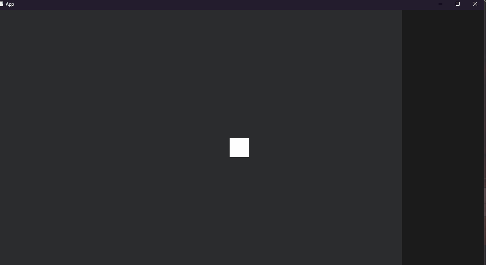

# bevy_flurx

[](https://crates.io/crates/bevy_flurx)
[](https://github.com/not-elm/bevy_flurx#license)
[](https://crates.io/crates/bevy_flurx)

This library provides a mechanism for more sequential description of delays, character movement,
waiting for user input, and other state waits.

As an example, here is an example of a cut-in effect that involves waiting for user input, a slight delay, and a sprite
to move.


The full source code can be found [here](examples/cut_in.rs).

```rust
fn spawn_reactor(
    mut commands: Commands
) {
    commands.spawn(Flow::schedule(|task| async move {
        task.will(Update, {
            wait::input::just_pressed().with(KeyCode::KeyR)
                .then(once::switch::on::<CutInBackground>())
                .then(delay::time().with(Duration::from_millis(100)))
                .then(once::switch::on::<HandsomeFerris>())
                .then(wait::both(
                    wait::switch::off::<CutInBackground>(),
                    wait::switch::off::<HandsomeFerris>(),
                ))
                .then(once::switch::on::<MoveSlowly>())
                .then(delay::time().with(Duration::from_millis(500)))
                .then(once::switch::off::<MoveSlowly>())
                .then(once::switch::on::<MoveFast>())
                .then(delay::time().with(Duration::from_millis(300)))
                .then(once::event::app_exit())
        })
            .await;
    }));
}
```

## Example

All examples are [`here`](./examples).

## Feature flags

| flag name | short description              | default |
|-----------|--------------------------------|---------|
| audio     | audio actions                  | true    |
| record    | undo/redo actions and events   | true    | 
| effect    | thread/async side effects      | true    |
| tokio     | async-compat and async actions | false   | 

### audio

Provides the actions that perform simple audio playback and waiting using bevy's default audio functionality.

- once::audio
- wait::audio

### record

Provides `Record` to manage operation history.



### effect

Allows to convert the operations with side effects such as asynchronous runtime or thread into the
referential-transparent actions.

### tokio

You will be able to write processes that depend on tokio's runtime in the reactor.

## ChangeLog

Please see [here](https://github.com/not-elm/bevy_flurx/blob/main/CHANGELOG.md).

## Compatible Bevy versions

| bevy_flurx    | bevy   |
|---------------|--------|
| 0.3.0         | 0.13.0 |
| 0.3.1         | 0.13.1 |
| 0.3.2 ~ 0.5.3 | 0.13.2 | 
| 0.6.0         | 0.14.1 | 
| 0.7.0         | 0.15   | 

## License

This crate is licensed under the MIT License or the Apache License 2.0.
